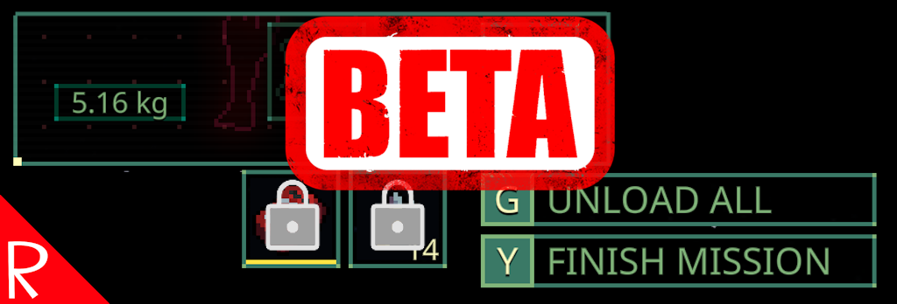

# Quasimorph Don't Unload Vest Slots

On the after raid screen, prevents the vest quick slots at the bottom of the screen from being unloaded.

Click the unload button while holding shift to use the normal unload which unloads the vest slots.

# Support
If you enjoy my mods and want to buy me a coffee, check out my [Ko-Fi](https://ko-fi.com/nbkredspy71915) page.
Thanks!

# Source Code
Source code is available on GitHub at https://github.com/NBKRedSpy/QM_DontUnloadVestSlots

# Change Log
## 1.0.1
* Added shift to do regular unload
